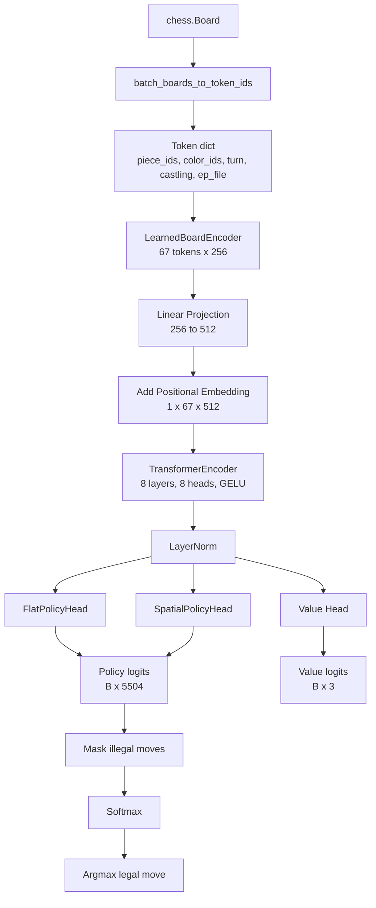

# Current Architecture

This document describes the architecture currently used in
[`experiments/exp050_head_comparison.py`](/root/transform/experiments/exp050_head_comparison.py).

It is the "current working" model, not the target V1 design from
[`ARCHITECTURE_V1.md`](/root/transform/ARCHITECTURE_V1.md).

## Overview

Two policy-head variants share the same encoder and transformer body:

- `FlatPolicyHead`
- `SpatialPolicyHead`

Both output logits over the same fixed move vocabulary from
[`move_vocab.py`](/root/transform/move_vocab.py), where `VOCAB_SIZE = 5504`.

## End-to-End Diagram

```text
chess.Board
   |
   v
batch_boards_to_token_ids(...)
   |
   v
Token-ID dict
  - piece_ids: (B, 64)
  - color_ids: (B, 64)
  - turn:      (B,)
  - castling:  (B,)
  - ep_file:   (B,)
   |
   v
LearnedBoardEncoder(embed_dim=256)
  - piece_embed
  - color_proj
  - square_embed
  - turn/castling/ep embeddings
  - LayerNorm
   |
   v
Tokens: (B, 67, 256)
[turn] [castling] [ep] [sq0] ... [sq63]
   |
   v
Linear input projection
256 -> 512
   |
   v
+ learned positional embedding: (1, 67, 512)
   |
   v
TransformerEncoder
  - 8 layers
  - 8 heads
  - GELU
  - dropout=0.1
  - norm_first=True
   |
   v
Hidden states: (B, 67, 512)
   |
   +------------------------------+
   |                              |
   v                              v
Policy head                       Value head
(flat or spatial)                 token 0 -> MLP
   |                              512 -> 256 -> 3
   v
Policy logits: (B, 5504)          Value logits: (B, 3)
   |
   v
Mask illegal moves with legal_move_mask(board)
   |
   v
Softmax over legal moves
   |
   v
Predicted best legal move
```

## Mermaid Diagram



## Token Layout

The current token order is:

```text
[turn] [castling] [ep] [sq0] [sq1] ... [sq63]
```

Important detail:

- Token `0` is the `turn` token.
- The current model uses token `0` as the global readout for:
  - `FlatPolicyHead`
  - `Value head`
  - global context inside `SpatialPolicyHead`

So the model does not currently use a dedicated `[CLS]` token.

## Shared Model Body

### LearnedBoardEncoder

Input:

- `piece_ids`: which piece is on each square
- `color_ids`: empty / white / black
- `turn`
- `castling`
- `ep_file`

Per-square representation:

```text
color_proj[color](piece_embed[piece]) + square_embed[square]
```

Then 3 context tokens are prepended:

- `turn`
- `castling`
- `ep`

Output:

- `(B, 67, 256)`

### Transformer Body

- Input projection: `256 -> 512`
- Learnable positional embedding: `(1, 67, 512)`
- `nn.TransformerEncoder`
- `num_layers = 8`
- `num_heads = 8`
- `dropout = 0.1`
- Feed-forward width: `4 * hidden_dim`

Output:

- hidden states `(B, 67, 512)`

## Policy Head Variants

### Variant A: FlatPolicyHead

Reads only token `0`:

```text
hidden[:, 0, :] -> Linear(512, 512) -> ReLU -> Linear(512, 5504)
```

Output:

- `policy_logits`: `(B, 5504)`

### Variant B: SpatialPolicyHead

Reads:

- square tokens `hidden[:, 3:67, :]`
- token `0` as global context

For each move in the 5504-move vocabulary:

```text
from_feat = from_proj(square_hidden[from_sq])
to_feat = to_proj(square_hidden[to_sq])
global_feat = global_proj(global_hidden)
promo_feat = promo_embed(promo_type)

combined = from_feat * to_feat + global_feat + promo_feat
logit = score_proj(ReLU(combined))
```

Output:

- `policy_logits`: `(B, 5504)`

## Value Head

The current experiment defines a value head even though the head-comparison
training loop only optimizes policy loss.

Current structure:

```text
hidden[:, 0, :] -> Linear(512, 256) -> ReLU -> Linear(256, 3)
```

Output:

- `value_logits`: `(B, 3)` for win / draw / loss

## Inference Path

At inference time:

1. Run a forward pass to get `policy_logits`
2. Build a legal-move mask with `legal_move_mask(board)`
3. Set illegal logits to `-inf`
4. Apply softmax
5. Take argmax

```text
policy_logits -> legal mask -> masked logits -> softmax -> best legal move
```

## Current Shapes Summary

| Stage | Shape |
|------|------|
| token ids | dict of board features |
| encoder output | `(B, 67, 256)` |
| projected tokens | `(B, 67, 512)` |
| transformer output | `(B, 67, 512)` |
| policy logits | `(B, 5504)` |
| value logits | `(B, 3)` |

## Notes

- Move legality is not built into the head; it is enforced after the head by masking.
- The current model is encoder-only and chess-native.
- The main comparison in `exp050` is not body vs body; it is head vs head on the same body.
- The current implementation uses the `turn` token as the de facto global token.
