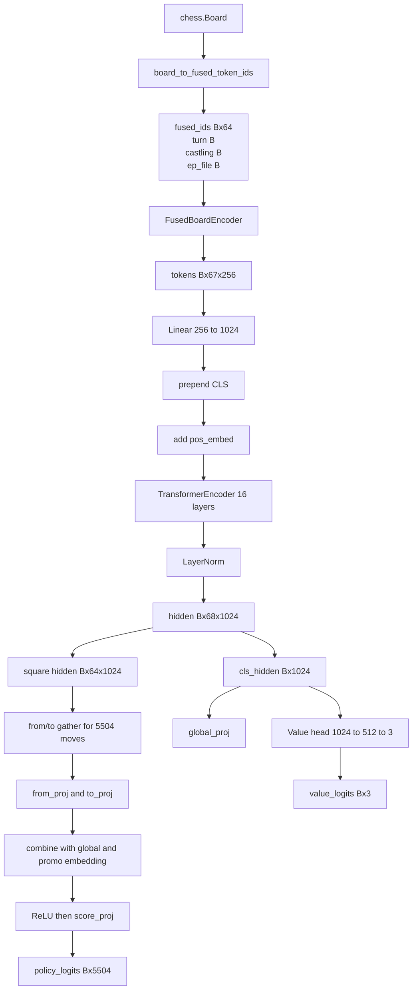

# Exp083 / Exp084 Model Architecture

This document describes the model currently used by the `exp083` family and by
the active `exp084_old_model_on_exp083.py` trainer. The actual model class is
[`ChessTransformer200M`](/root/transform/play.py), and its board encoder comes
from [`FusedBoardEncoder`](/root/transform/chess_model.py).

The goal here is to document every learned block and every tensor transformation
from `chess.Board` to:

- `policy_logits: (B, 5504)`
- `value_logits: (B, 3)`

The description below is code-accurate to the current implementation.

## One-Line Summary

The model is a chess-native encoder-only transformer:

1. Encode a board into `67` chess tokens with a fused piece-color embedding.
2. Project tokens from width `256` to transformer width `1024`.
3. Prepend a learned `[CLS]` token and add learned positional embeddings.
4. Run a `16`-layer `nn.TransformerEncoder`.
5. Use:
   - `[CLS]` for a 3-class WDL value head
   - square tokens plus `[CLS]` for a factorized spatial policy head over `5504` UCI moves

## High-Level Block Diagram

```text
chess.Board
  |
  v
board_to_fused_token_ids(board)
  |
  v
token dict
  fused_ids : (B, 64)
  turn      : (B,)
  castling  : (B,)
  ep_file   : (B,)
  |
  v
FusedBoardEncoder(embed_dim=256)
  |
  v
tokens: (B, 67, 256)
  layout:
    [turn] [castling] [ep] [sq0] [sq1] ... [sq63]
  |
  v
input_proj: Linear(256 -> 1024)
  |
  v
hidden: (B, 67, 1024)
  |
  v
prepend learned [CLS]
  |
  v
hidden: (B, 68, 1024)
  |
  v
add learned positional embedding pos_embed: (1, 68, 1024)
  |
  v
TransformerEncoder
  16 layers
  16 heads
  FFN width 4096
  GELU
  dropout 0.1
  norm_first=True
  |
  v
LayerNorm(1024)
  |
  v
final hidden: (B, 68, 1024)
  |
  +--> cls_hidden = hidden[:, 0, :] ---------------------------> value_head -> (B, 3)
  |
  +--> hidden + cls_hidden into SpatialPolicyHead -------------> policy_head -> (B, 5504)
```

## Parameter Breakdown

Approximate learned parameter counts from the current model instance:

| Block | Parameters |
|---|---:|
| `encoder` | `27,136` |
| `input_proj` | `263,168` |
| `cls_token` | `1,024` |
| `pos_embed` | `69,632` |
| `transformer` | `201,539,584` |
| `norm` | `2,048` |
| `policy_head` | `1,577,473` |
| `value_head` | `526,339` |
| **Total** | **204,006,404** |

Most of the parameter budget lives in the transformer body.

## Stage 0: Raw Chess Position

The semantic input is a `python-chess` `chess.Board`.

Important board facts that survive into the model:

- piece identity on all 64 squares
- piece color on all 64 squares
- side to move
- castling rights
- en passant file

Important board facts that do **not** appear as separate explicit inputs:

- halfmove clock
- fullmove number
- repetition count
- move history beyond what can be inferred from the current board state

## Stage 1: Tokenization in `chess_features.py`

The active model uses fused tokenization via
[`board_to_fused_token_ids`](/root/transform/chess_features.py).

### 1.1 Fused Piece-Color IDs

Each square gets one integer in `[0, 12]`:

```text
0   = empty
1   = white pawn
2   = white knight
3   = white bishop
4   = white rook
5   = white queen
6   = white king
7   = black pawn
8   = black knight
9   = black bishop
10  = black rook
11  = black queen
12  = black king
```

This becomes:

- `fused_ids: (B, 64)`

### 1.2 Side to Move

Encoded as:

- `0 = white`
- `1 = black`

Tensor:

- `turn: (B,)`

### 1.3 Castling Rights

Castling is packed into a 4-bit integer:

```text
bit 0 -> white kingside
bit 1 -> white queenside
bit 2 -> black kingside
bit 3 -> black queenside
```

So there are `16` possible castling states:

- `castling: (B,)`, values `0..15`

### 1.4 En Passant

Only the file is represented:

- `0 = none`
- `1..8 = file a..h`

Tensor:

- `ep_file: (B,)`

### 1.5 Batched Input Dictionary

The full batched encoder input is:

```text
{
  "fused_ids": (B, 64),
  "turn":      (B,),
  "castling":  (B,),
  "ep_file":   (B,),
}
```

## Stage 2: `FusedBoardEncoder`

Defined in [`chess_model.py`](/root/transform/chess_model.py).

### 2.1 Learned Tables

`FusedBoardEncoder(embed_dim=256)` contains:

- `piece_color_embed = nn.Embedding(13, 256)`
- `square_embed = nn.Embedding(64, 256)`
- `turn_embed = nn.Embedding(2, 256)`
- `castling_embed = nn.Embedding(16, 256)`
- `ep_embed = nn.Embedding(9, 256)`
- `norm = nn.LayerNorm(256)`

### 2.2 Square Token Construction

For each square index `sq in 0..63`:

```text
square_token[sq] =
    piece_color_embed[fused_ids[sq]]
  + square_embed[sq]
```

Result:

- `sq_emb: (B, 64, 256)`

### 2.3 Context Token Construction

Three special context tokens are embedded separately:

```text
turn_tok   = turn_embed(turn)          -> (B, 1, 256)
castle_tok = castling_embed(castling)  -> (B, 1, 256)
ep_tok     = ep_embed(ep_file)         -> (B, 1, 256)
```

### 2.4 Encoder Output Layout

The encoder concatenates them in this order:

```text
[turn] [castling] [ep] [sq0] [sq1] ... [sq63]
```

So the encoder output is:

- `tokens: (B, 67, 256)`

After concatenation, `LayerNorm(256)` is applied across the last dimension.

## Stage 3: Input Projection

The transformer body runs at width `1024`, but the board encoder runs at width
`256`. The bridge is:

```text
input_proj = Linear(256, 1024)
```

Applied independently to each token:

```text
hidden = input_proj(tokens)
```

Shape change:

- input: `(B, 67, 256)`
- output: `(B, 67, 1024)`

## Stage 4: Learned `[CLS]` Token

The model creates one learned global token:

```text
cls_token: Parameter(1, 1, 1024)
```

At runtime it is expanded across batch:

```text
cls = cls_token.expand(B, -1, -1)
hidden = cat([cls, hidden], dim=1)
```

Shape change:

- before: `(B, 67, 1024)`
- after: `(B, 68, 1024)`

### Final Token Order Before Transformer

```text
position 0  -> [CLS]
position 1  -> [turn]
position 2  -> [castling]
position 3  -> [ep]
position 4  -> [sq0]
...
position 67 -> [sq63]
```

This ordering matters because the policy head later slices square tokens using
`hidden[:, 4:68, :]`.

## Stage 5: Positional Embeddings

The model has a learned absolute positional tensor:

```text
pos_embed: Parameter(1, 68, 1024)
```

It is added elementwise:

```text
hidden = hidden + pos_embed
```

This means each of the `68` sequence positions has its own learned bias vector,
including `[CLS]`, `[turn]`, `[castling]`, and `[ep]`.

## Stage 6: Transformer Body

The main trunk is:

```text
nn.TransformerEncoder(
    encoder_layer,
    num_layers=16
)
```

where each encoder layer is:

```text
nn.TransformerEncoderLayer(
    d_model=1024,
    nhead=16,
    dim_feedforward=4096,
    dropout=0.1,
    activation="gelu",
    batch_first=True,
    norm_first=True,
)
```

### 6.1 What Each Layer Does

At a high level, each encoder layer performs:

```text
x = x + SelfAttention(LayerNorm(x))
x = x + FFN(LayerNorm(x))
```

because `norm_first=True`.

### 6.2 Attention Geometry

For each layer:

- model width: `1024`
- number of heads: `16`
- per-head width: `1024 / 16 = 64`
- sequence length: `68`

So each layer attends over:

- `1` CLS token
- `3` context tokens
- `64` square tokens

### 6.3 Feedforward Block

The internal MLP expands and contracts:

```text
1024 -> 4096 -> 1024
```

with GELU nonlinearity and dropout.

### 6.4 Final LayerNorm

After the 16-layer encoder stack:

```text
norm = LayerNorm(1024)
hidden = norm(hidden)
```

Final hidden shape:

- `hidden: (B, 68, 1024)`

## Stage 7: Value Head

The value head consumes only the `[CLS]` token:

```text
cls_hidden = hidden[:, 0, :]   # (B, 1024)
```

Then:

```text
value_head = Sequential(
    Linear(1024, 512),
    ReLU(),
    Linear(512, 3),
)
```

Output:

- `value_logits: (B, 3)`

### Semantics of the 3 Outputs

The three classes represent WDL:

- class `0`: loss
- class `1`: draw
- class `2`: win

The trainer uses these logits with a classification-style value loss.

## Stage 8: Spatial Policy Head

The policy head is the most model-specific part of the architecture.

It is defined in [`play.py`](/root/transform/play.py) as
`SpatialPolicyHead(hidden_size=1024, n_ctx_tokens=4, head_dim=512)`.

### 8.1 Why It Exists

The policy head does **not** use a flat `Linear(1024, 5504)` classifier.
Instead, it builds each move logit from:

- the hidden state of the move's source square
- the hidden state of the move's destination square
- global context from `[CLS]`
- a promotion-type embedding

This bakes move structure into the head.

### 8.2 Precomputed Move Vocabulary Geometry

At init time, the head precomputes three arrays over all `5504` moves:

- `from_sqs: (5504,)`
- `to_sqs: (5504,)`
- `promo_types: (5504,)`

where `promo_types` uses:

```text
0 = no promotion
1 = queen
2 = rook
3 = bishop
4 = knight
```

These are buffers, not learned parameters.

### 8.3 Learned Submodules

The head contains:

- `from_proj = Linear(1024, 512)`
- `to_proj = Linear(1024, 512)`
- `global_proj = Linear(1024, 512)`
- `promo_embed = Embedding(5, 512)`
- `score_proj = Linear(512, 1)`

### 8.4 Input Slicing

The head assumes the first four tokens are:

```text
[CLS] [turn] [castling] [ep]
```

and square tokens begin at index `4`:

```text
sq_hidden = hidden[:, 4:68, :]   # (B, 64, 1024)
```

It separately receives:

```text
cls_hidden = hidden[:, 0, :]     # (B, 1024)
```

### 8.5 Broadcasting Over the Entire Move Vocabulary

For each batch element, it gathers source and destination square states for
every move in the vocabulary:

```text
from_feats = sq_hidden[:, from_sqs, :]   # (B, 5504, 1024)
to_feats   = sq_hidden[:, to_sqs, :]     # (B, 5504, 1024)
```

Then projects them:

```text
from_proj = from_proj(from_feats)        # (B, 5504, 512)
to_proj   = to_proj(to_feats)            # (B, 5504, 512)
```

Global context is projected once:

```text
global_proj = global_proj(cls_hidden)    # (B, 512)
global_proj = global_proj.unsqueeze(1)   # (B, 1, 512)
```

Promotion features are looked up once per move:

```text
promo_feats = promo_embed(promo_types)   # (5504, 512)
promo_feats = promo_feats.unsqueeze(0)   # (1, 5504, 512)
```

### 8.6 Logit Construction

Each move's hidden feature is:

```text
combined =
    from_proj * to_proj
  + global_proj
  + promo_feats
```

Important detail:

- source and destination interactions use **elementwise multiplication**
- global and promotion terms are added afterward

Then:

```text
logit = score_proj(ReLU(combined))   # (B, 5504, 1)
policy_logits = squeeze(-1)          # (B, 5504)
```

### 8.7 Policy Head Micro-Diagram

```text
final hidden states
  |
  +--> cls_hidden: (B, 1024)
  |       |
  |       +--> global_proj -----------------------------> (B, 1, 512)
  |
  +--> sq_hidden: (B, 64, 1024)
          |
          +--> gather from_sqs for 5504 moves ----------> (B, 5504, 1024)
          |       |
          |       +--> from_proj ------------------------> (B, 5504, 512)
          |
          +--> gather to_sqs for 5504 moves ------------> (B, 5504, 1024)
                  |
                  +--> to_proj --------------------------> (B, 5504, 512)

promo_types buffer: (5504,)
  |
  +--> promo_embed -------------------------------------> (1, 5504, 512)

combined = from_proj * to_proj + global_proj + promo_embed
  |
  v
ReLU
  |
  v
score_proj: Linear(512 -> 1)
  |
  v
policy_logits: (B, 5504)
```

## Stage 9: Move Vocabulary and Legality

The model always emits logits over the fixed move vocabulary from
[`move_vocab.py`](/root/transform/move_vocab.py).

### 9.1 Vocabulary Size

```text
VOCAB_SIZE = 5504
```

This is a geometric superset of possible UCI moves, including promotion
variants. Most of these moves are illegal in any given position.

### 9.2 Legality Handling

Legality is **not** enforced inside the transformer or policy head.

Instead, at inference and eval time:

```text
mask = legal_move_mask(board)   # (5504,) bool
logits[~mask] = -inf
```

Then the legal-move distribution is taken over the masked logits.

## Full End-to-End Diagram

```text
┌────────────────────────────────────────────────────────────────────────────┐
│ Input position                                                            │
│   chess.Board                                                             │
└────────────────────────────────────────────────────────────────────────────┘
                                      |
                                      v
┌────────────────────────────────────────────────────────────────────────────┐
│ Tokenization                                                              │
│   fused_ids : (B, 64)   piece-color ids in 0..12                          │
│   turn      : (B,)      0=white, 1=black                                  │
│   castling  : (B,)      4-bit state in 0..15                              │
│   ep_file   : (B,)      0=none, 1..8=file a..h                            │
└────────────────────────────────────────────────────────────────────────────┘
                                      |
                                      v
┌────────────────────────────────────────────────────────────────────────────┐
│ FusedBoardEncoder (embed_dim=256)                                         │
│                                                                            │
│   square token = piece_color_embed[fused_id] + square_embed[square_idx]   │
│   turn token   = turn_embed[turn]                                          │
│   castle token = castling_embed[castling]                                  │
│   ep token     = ep_embed[ep_file]                                         │
│   LayerNorm(256)                                                           │
│                                                                            │
│   output layout:                                                           │
│   [turn] [castling] [ep] [sq0] [sq1] ... [sq63]                           │
│                                                                            │
│   shape: (B, 67, 256)                                                      │
└────────────────────────────────────────────────────────────────────────────┘
                                      |
                                      v
┌────────────────────────────────────────────────────────────────────────────┐
│ Input projection                                                          │
│   Linear(256 -> 1024)                                                     │
│   shape: (B, 67, 1024)                                                    │
└────────────────────────────────────────────────────────────────────────────┘
                                      |
                                      v
┌────────────────────────────────────────────────────────────────────────────┐
│ Sequence augmentation                                                     │
│   prepend learned [CLS] token                                             │
│   add learned positional embedding                                        │
│   shape: (B, 68, 1024)                                                    │
└────────────────────────────────────────────────────────────────────────────┘
                                      |
                                      v
┌────────────────────────────────────────────────────────────────────────────┐
│ Transformer body                                                          │
│   16 x TransformerEncoderLayer                                            │
│   each layer:                                                             │
│     - 16-head self-attention                                              │
│     - model dim 1024                                                      │
│     - head dim 64                                                         │
│     - FFN 1024 -> 4096 -> 1024                                            │
│     - GELU                                                                │
│     - dropout 0.1                                                         │
│     - norm_first=True                                                     │
│   final LayerNorm(1024)                                                   │
│   output shape: (B, 68, 1024)                                             │
└────────────────────────────────────────────────────────────────────────────┘
                                      |
                    ┌─────────────────┴─────────────────┐
                    │                                   │
                    v                                   v
┌───────────────────────────────┐         ┌──────────────────────────────────┐
│ Value path                    │         │ Policy path                      │
│   cls_hidden = hidden[:, 0]   │         │   sq_hidden = hidden[:, 4:68]    │
│   shape: (B, 1024)            │         │   shape: (B, 64, 1024)           │
│                               │         │   cls_hidden also reused         │
│   Linear(1024 -> 512)         │         │                                  │
│   ReLU                        │         │   gather from/to square states   │
│   Linear(512 -> 3)            │         │   for all 5504 moves             │
│                               │         │                                  │
│   output: (B, 3)              │         │   from_proj, to_proj,            │
│   [loss, draw, win]           │         │   global_proj, promo_embed       │
└───────────────────────────────┘         │   combine -> ReLU -> score_proj  │
                                          │                                  │
                                          │   output: (B, 5504)              │
                                          └──────────────────────────────────┘
```

## Mermaid Diagram



## Tensor Shape Table

| Stage | Shape |
|---|---|
| `fused_ids` | `(B, 64)` |
| `turn` | `(B,)` |
| `castling` | `(B,)` |
| `ep_file` | `(B,)` |
| encoder output | `(B, 67, 256)` |
| after `input_proj` | `(B, 67, 1024)` |
| after prepending `[CLS]` | `(B, 68, 1024)` |
| after transformer + norm | `(B, 68, 1024)` |
| `cls_hidden` | `(B, 1024)` |
| `sq_hidden` | `(B, 64, 1024)` |
| `policy_logits` | `(B, 5504)` |
| `value_logits` | `(B, 3)` |

## Training Semantics

The active `exp084` training script uses this architecture with:

- policy supervision from `best_move`
- soft policy supervision from `soft_targets`
- value supervision from `value_target`

The trainer mixes:

- hard move cross-entropy
- KL to teacher soft targets
- value cross-entropy

So the architecture is a dual-head model:

- policy head for move choice
- value head for WDL outcome class

## Important Notes and Caveats

### The Model Is Not Autoregressive

It does not generate text or moves token-by-token.
It is a fixed-vocabulary classifier over chess moves.

### The Policy Head Is Structured, Not Flat

This is one of the key design choices.
Moves are scored from source square, destination square, global context, and
promotion type instead of using a single huge output projection.

### Board History Is Limited

Only current board state plus side/castling/ep survive into the encoder.
No explicit repetition or move-clock history is modeled.

### Legality Is Applied Outside the Head

The head can emit scores for illegal moves.
Legal masking happens afterward with `legal_move_mask(board)`.

## Source References

- Model class: [`play.py`](/root/transform/play.py)
- Encoders: [`chess_model.py`](/root/transform/chess_model.py)
- Board tokenization: [`chess_features.py`](/root/transform/chess_features.py)
- Move vocabulary: [`move_vocab.py`](/root/transform/move_vocab.py)
- Trainer using this architecture: [`experiments/exp084_old_model_on_exp083.py`](/root/transform/experiments/exp084_old_model_on_exp083.py)
