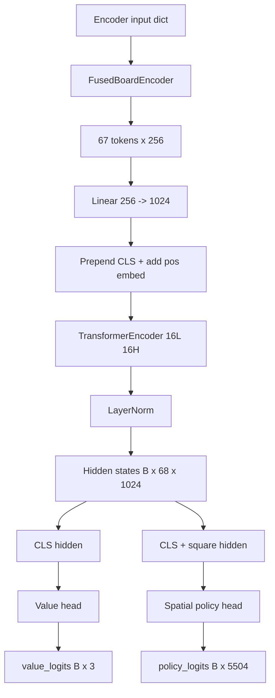

# Exp083 Model Architecture

This is the current training model used in [`experiments/exp083_pretrain_4xa40.py`](/root/transform/experiments/exp083_pretrain_4xa40.py).

## Summary

- Model: `ChessTransformer200M`
- Parameters: ~204M
- Encoder: `FusedBoardEncoder`
- Transformer: encoder-only, 16 layers, 16 heads, hidden size 1024
- Heads:
  - factorized spatial policy head over 5,504 UCI moves
  - WDL value head over 3 classes

## End-To-End Diagram

This version keeps the main path linear and moves the policy-head internals into
their own smaller diagram.

```text
board tensors
  |
  v
Encoder input dict
  fused_ids (B, 64)
  turn      (B,)
  castling  (B,)
  ep_file   (B,)
  |
  v
FusedBoardEncoder
  - fused piece/color embedding
  - square embedding
  - 3 context tokens
  |
  v
tokens: (B, 67, 256)
  |
  v
Linear projection 256 -> 1024
  |
  v
prepend learned [CLS]
  |
  v
add learned positional embedding
  |
  v
TransformerEncoder
  - 16 layers
  - 16 heads
  - FFN 4096
  - GELU, dropout 0.1, norm_first
  |
  v
LayerNorm
  |
  v
hidden states: (B, 68, 1024)
  |
  +--> CLS token hidden state ------------------> Value head ---------> value_logits (B, 3)
  |
  +--> CLS + 64 square hidden states -----------> SpatialPolicyHead -> policy_logits (B, 5504)
```

## Policy Head Diagram

```text
Transformer output
  |
  +--> cls_hidden                -> global_proj -> global_feat
  |
  +--> square_hidden[64]
         |
         +--> from_sq per move   -> from_proj   -> from_feat
         |
         +--> to_sq per move     -> to_proj     -> to_feat
         |
promo_type per move              -> promo_embed -> promo_feat

combined = from_feat * to_feat + global_feat + promo_feat
logit    = score_proj(ReLU(combined))

Output: one logit for each of 5,504 moves
```

## Compact Mermaid



## Token Layout

```text
Position 0:  [CLS]
Position 1:  [turn]
Position 2:  [castling]
Position 3:  [ep]
Position 4-67: [sq0] ... [sq63]
```

## Tensor Shapes

```text
Input:
  fused_ids    : (B, 64)
  turn         : (B,)
  castling     : (B,)
  ep_file      : (B,)

Encoder output:
  tokens       : (B, 67, 256)

After projection + CLS:
  hidden       : (B, 68, 1024)

Outputs:
  policy_logits: (B, 5504)
  value_logits : (B, 3)
```

## Policy Head Detail

For each move in the fixed 5,504-move vocabulary:

```text
from_feat   = from_proj(square_hidden[from_sq])
to_feat     = to_proj(square_hidden[to_sq])
global_feat = global_proj(cls_hidden)
promo_feat  = promo_embed(promo_type)

combined = from_feat * to_feat + global_feat + promo_feat
logit    = score_proj(ReLU(combined))
```

This means the policy head is not a flat `1024 -> 5504` classifier. It uses:

- the hidden state of the move's source square
- the hidden state of the move's destination square
- global board context from `CLS`
- promotion type embedding

## Training Outputs

- `policy_logits`: best-move prediction over the fixed move vocabulary
- `value_logits`: WDL prediction
- training loss in `exp083` is:

```text
loss = policy_cross_entropy + 0.5 * value_KL
```

## Source References

- Model definition: [`experiments/exp083_pretrain_4xa40.py`](/root/transform/experiments/exp083_pretrain_4xa40.py)
- Encoder: [`chess_model.py`](/root/transform/chess_model.py)
- Move vocabulary: [`move_vocab.py`](/root/transform/move_vocab.py)
- Data pipeline: [`data_loader.py`](/root/transform/data_loader.py)
