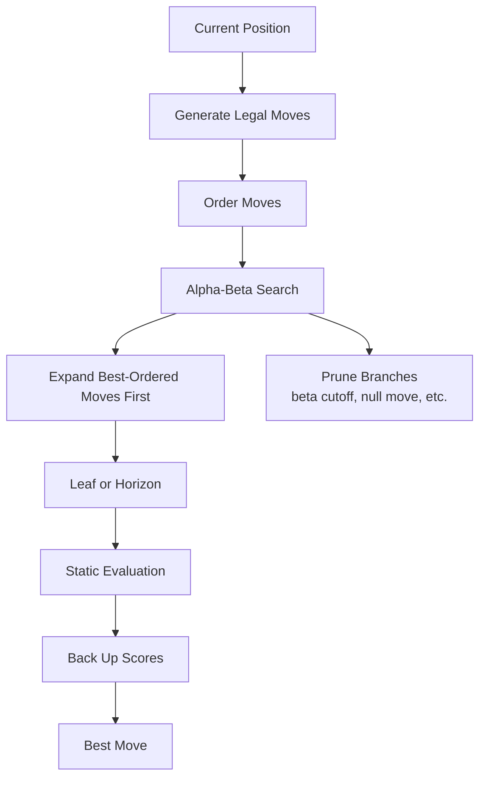
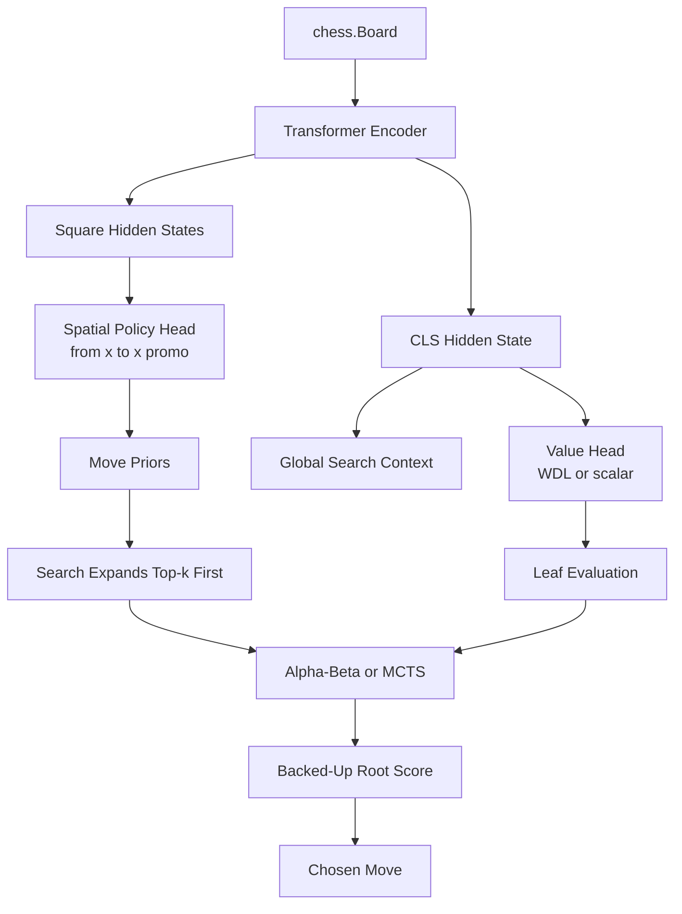
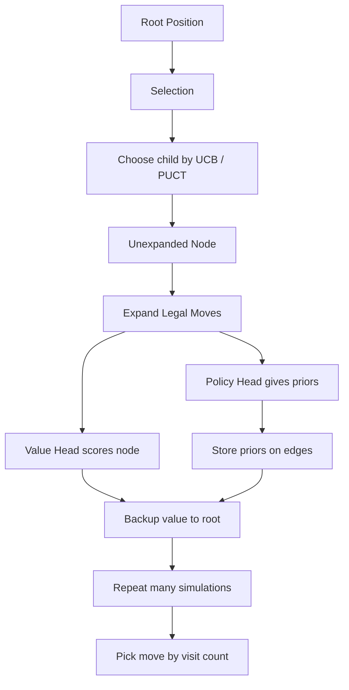

# Search With Attention

This document explains:

1. How Stockfish gets strong
2. How that differs from a transformer policy/value model
3. How we can combine search with attention in this repo

It is written for the current architecture in:

- [experiments/exp053_scaled_spatial.py](/root/transform/experiments/exp053_scaled_spatial.py)
- [experiments/exp054_search_baseline.py](/root/transform/experiments/exp054_search_baseline.py)
- [experiments/exp055_joint_policy_value.py](/root/transform/experiments/exp055_joint_policy_value.py)

## Big Picture

Stockfish is not strong because it has a single great move predictor.
It is strong because it searches extremely well.

Very roughly:

```text
Stockfish strength = strong evaluation + very strong move ordering + very deep alpha-beta search
```

For us, the equivalent goal is:

```text
Transformer strength = policy prior + value estimate + search on top
```

That means the model should not just output one move.
It should help a search procedure decide:

- which moves to expand first
- which positions look promising
- when to cut off bad branches

## How Stockfish Works

Stockfish is a classical chess engine built around alpha-beta search, not attention.

At a high level:

```text
position
  -> generate legal moves
  -> order moves well
  -> search game tree with alpha-beta pruning
  -> at leaf / horizon: evaluate position
  -> back up scores to choose best move
```

## Stockfish Diagram



## What Alpha-Beta Is Doing

Alpha-beta is minimax with pruning.

- `max` nodes: "our turn", try to maximize score
- `min` nodes: "opponent turn", assume opponent minimizes our score
- `alpha`: best guaranteed score so far for max
- `beta`: best guaranteed score so far for min

If a branch is already worse than something we can get elsewhere, stop searching it.

That pruning is why Stockfish can search much deeper than naive minimax.

## Why Move Ordering Matters So Much

Alpha-beta becomes dramatically better when the best moves are searched first.

Stockfish spends a lot of effort on move ordering:

- transposition table move
- captures and tactical moves
- killer moves
- history heuristics
- principal variation reuse

This is important for us because a transformer policy head can act like a learned move-ordering heuristic.

That is one of the most promising ways to use attention in search.

## Where Attention Fits

Attention is not a replacement for search.
It is a learned evaluator and prioritizer.

Your transformer can do three valuable jobs:

1. `Policy`
   Give a prior over legal moves.
   This is a learned move-ordering signal.

2. `Value`
   Estimate whether the position is winning, drawing, or losing.
   This is a learned leaf evaluator.

3. `Representation`
   Encode the board globally so long-range interactions are modeled well.
   This helps both policy and value.

## Attention + Search Diagram



## Mapping Stockfish Ideas to This Repo

| Stockfish concept | Transformer equivalent here |
|---|---|
| move ordering | policy head probabilities |
| static evaluation | value head |
| principal variation | top searched line from root |
| pruning / selective expansion | top-k expansion from policy |
| search tree | alpha-beta or MCTS over `chess.Board` |
| handcrafted eval | learned eval from attention |

## A Good First Version: Shallow Alpha-Beta

The simplest useful system is not full MCTS.
It is shallow alpha-beta with learned move ordering and learned value.

### Root idea

At each node:

1. Generate legal moves
2. Use policy head to rank them
3. Keep only top `k`
4. Search recursively to depth `d`
5. Use value head at leaf nodes

This is already much closer to "engine behavior" than pure argmax policy.

## Shallow Alpha-Beta Diagram

```text
root position
  -> policy head ranks legal moves
  -> keep top-k
  -> for each move:
       make move
       recurse to depth-1
         opponent also uses top-k
         leaf uses value head
  -> minimax backup
  -> choose move with best backed-up score
```

## Pseudocode: Alpha-Beta With Policy + Value

```python
def evaluate_value(model, board, device):
    # value in [-1, 1] from side-to-move perspective
    return model.get_value(board, device)


def ordered_moves(model, board, device, top_k):
    probs = model.get_policy(board, device)
    ranked = probs.topk(min(top_k, probs.numel())).indices.tolist()
    moves = []
    for idx in ranked:
        move = index_to_move(idx)
        if move in board.legal_moves:
            moves.append(move)
    return moves


def alphabeta(model, board, depth, alpha, beta, device, top_k):
    if depth == 0 or board.is_game_over():
        return evaluate_value(model, board, device)

    moves = ordered_moves(model, board, device, top_k)
    if not moves:
        return evaluate_value(model, board, device)

    best = -1e9
    for move in moves:
        child = board.copy()
        child.push(move)

        # negate because side-to-move flips
        score = -alphabeta(model, child, depth - 1, -beta, -alpha, device, top_k)

        if score > best:
            best = score
        if best > alpha:
            alpha = best
        if alpha >= beta:
            break

    return best
```

This is negamax-style alpha-beta, which is usually the cleanest version to implement.

## Why This Fits Your Current Code

You already have the needed pieces:

- policy priors in [experiments/exp053_scaled_spatial.py](/root/transform/experiments/exp053_scaled_spatial.py)
- search scaffolding in [experiments/exp054_search_baseline.py](/root/transform/experiments/exp054_search_baseline.py)
- value training in [experiments/exp055_joint_policy_value.py](/root/transform/experiments/exp055_joint_policy_value.py)

So the search stack can become:

```text
exp053 = better policy backbone
exp055 = trained value head
exp054 = search wrapper that uses both
```

## MCTS Version

MCTS is more "AlphaZero-like" than Stockfish-like.

Instead of exhaustive minimax over a small subtree, MCTS repeatedly:

1. selects a path using an upper-confidence rule
2. expands a leaf
3. evaluates with policy + value
4. backs up the value

## MCTS Diagram



## PUCT Formula

The common AlphaZero-style score is:

```text
PUCT(s, a) = Q(s, a) + c_puct * P(s, a) * sqrt(N(s)) / (1 + N(s, a))
```

Where:

- `Q(s, a)` is the current backed-up value
- `P(s, a)` is the policy prior from the transformer
- `N(s)` is total visits to the parent
- `N(s, a)` is visits to that move

This is where attention helps directly:

- policy prior tells MCTS what to explore first
- value head lets MCTS stop early without rollouts

## Alpha-Beta vs MCTS For You

For this repo, I would start with alpha-beta first.

Why:

- easier to implement correctly
- easier to debug
- closer to the current `top-k + rerank` logic in `exp054`
- cheaper on a single GPU
- strong enough to show whether search helps

Then add MCTS once the value head becomes trustworthy.

## Proposed Repo Design

### Phase 1: Search Baseline

Use:

- top-k policy move ordering
- depth-1 and depth-2 negamax alpha-beta
- leaf evaluation from trained value head

Diagram:

```text
root board
  -> transformer
  -> policy top-k
  -> search children
  -> value head at leaves
  -> choose best move
```

### Phase 2: Stronger Engine Loop

Add:

- transposition table keyed by FEN or zobrist hash
- quiescence search for tactical leaves
- iterative deepening
- aspiration windows
- time control instead of fixed depth

This is where you start to look more engine-like.

### Phase 3: MCTS / AlphaZero Hybrid

Add:

- PUCT node selection
- policy prior on expansion
- value-only leaf eval
- self-play improvement loop

This is the more neural-native path.

## Important Limitations

A few candid notes:

- A policy model alone will not beat Stockfish.
- A weak value head can make search worse, not better.
- Restricting to policy top-k can miss tactical refutations if `k` is too small.
- Classical engine tricks still matter, even with attention.

So the right framing is not:

```text
attention instead of search
```

It is:

```text
attention guides search
```

## Practical Implementation Plan

### Version 1

In [experiments/exp054_search_baseline.py](/root/transform/experiments/exp054_search_baseline.py):

- keep `strategy_policy_argmax`
- replace simple rerank with depth-2 negamax alpha-beta
- use policy head for move ordering
- use value head for leaf eval

### Version 2

In [experiments/exp055_joint_policy_value.py](/root/transform/experiments/exp055_joint_policy_value.py):

- improve value target quality
- log value calibration
- save checkpoints specifically for search use

### Version 3

Add a new experiment:

- `exp056_negamax_search.py` or
- `exp056_mcts_search.py`

with:

- transposition table
- iterative deepening
- top-k expansion from policy prior
- root diagnostics: searched nodes, PV, cutoff counts

## Final Mental Model

Think of the transformer as a learned replacement for two expensive handcrafted parts:

- move ordering
- static evaluation

Think of the search algorithm as the part that turns those learned heuristics into actual playing strength.

## One-Line Summary

Stockfish wins by searching deeply with excellent pruning and move ordering.
Your best path is to use attention to supply the ordering and evaluation, then wrap that model in alpha-beta first and MCTS later.
