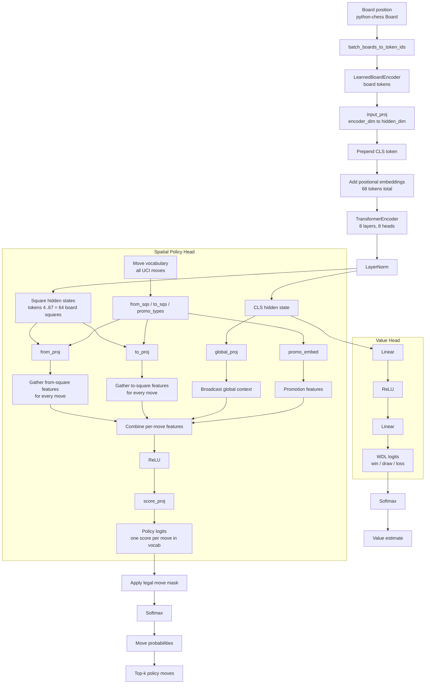

# `exp063_search_policy` Architecture

## Notes

- The trunk is a single transformer over board tokens plus one `CLS` token.
- The policy head is a one-shot spatial scorer over the full move vocabulary.
- The value head reads only the final `CLS` representation.
- Search is not inside the network; inference uses masked policy probabilities and optional downstream reranking.
